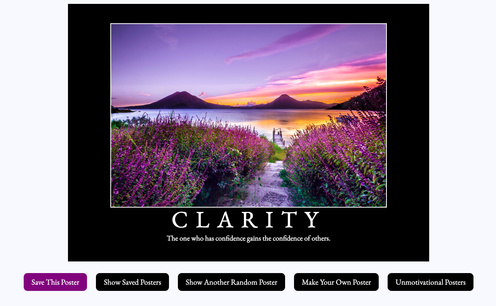

# Hang in There  

### Abstract:
[//]: <> 
  - This project was a motivational poster project. When you first open up the webpage you are presented with a random poster object. You can then click on the Show Random poster button to see other random posters, or the Make Your Own Poster button to make a poster of your choosing. You can also see unmotivational posters for when you are feeling less motivated and can delete any of those unmotivational posters of your choosing. You can save posters that you like in the Saved posters area. I feel the best feature of this project is the Make Your Own Poster as it has endless potential for fun!
    
### Installation Instructions:
[//]: <> 
  1. Fork this repository.
  2. Clone down your new, forked repo.
  3. `cd` into the repository.
  4. Open it in your text editor.

### Preview of App:
[//]: <> 
   
- This screenshot shows what the main page should look like and the Save This Poster button toggles betweeen purple and black when you save a poster. It will not change color if you are trying to save a poster that has already been saved.
   
### Context:
[//]: <> 
  - I had a week and half to work on this solo project as a Mod 2 student of Turing School of Software and Design. Each mod is 6 weeks long. This was my first real front end project. I learned HTML, CSS and Javascript while creating this project.
 
### Contributors:
[//]: <> (Who worked on this application? Link to your GitHub. Consider also providing LinkedIn link)
  -  [Candice Cirbo](www.linkedin.com/in/candicecirbo)
    
### Learning Goals:
[//]: <> (What were the learning goals of this project? What tech did you work with?)
  - The learning goals of this project were:
    -   How to work with existing code.
    -   How to write clean, DRY JavaScript.
        - Build out functionality using functions that show trends toward SRP
        - Manipulate the page after it has loaded by adding, removing, and updating elements on the DOM
        - Use array prototype iterator methods to reformat data and display it on the DOM
    -   Use CSS and HTML to match styling and layout of provided comps.
    -   
### Wins + Challenges:
[//]: <> (What are 2-3 wins you have from this project? What were some challenges you faced - and how did you get over them?)
- Some of the wins of this project was definitely getting all the functionality of the project to work! I had fun working on this project as there are so many ways to be creative within the project, like making silly posters or fun images.
- This project was also challenging as I had very little to no experience with HTML, CSS or Javascript. This was very daunting in the beginning, just figuring out where or how to start. Once I started digging into the project, the challenges were more about how to make the poster or the buttons do what I wanted them to do, figuring out the Javascript functions vs CSS vs what to put in the HTML. Overall I had a great time working on this project!
